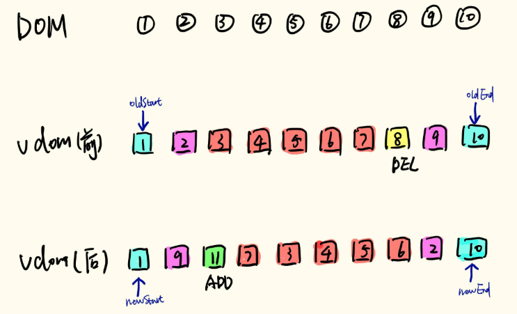

# Vue原理解析 - Virtual Dom（虚拟DOM）

`DOM`是文档对象模式（`Document Object Model`）的简写。在浏览器我们可以通过js来操作`DOM`,但是这样性能太差，于是`Virtual Dom`应运而生。`Vurtual Dom`就是模拟`DOM`对象书来优化`DOM`操作的一种技术或者思路。

### 一、VNode对象

* `EmptyVNode`: 没有内容的注释节点
* `TextVNode`: 文本节点
* `ElementVNode`: 普通元素节点
* `ComponentVNode`: 组件节点
* `CloneVNode`: 克隆节点，可以是以上任意类型的节点，唯一的区别在于`isCloned`属性为`true`

### 二、diff

Vue的diff算法仅在同级的vnode间做diff，递归地进行同级vnode的diff，最终实现整个DOM树的更新。

#### 1、简单的diff实现

逐个遍历`newVdom`的节点，找到它在`oldVdom`中的位置，如果找到了就移动对应的`DOM`元素。如果没找到说明是新增的节点，则新建一个节点插入。遍历玩成之后如果`oldVdom`中海油没有差不离的及诶单，则说明这些节点是`newVdom`中被删除的节点。

#### 2、Vue的diff实现

