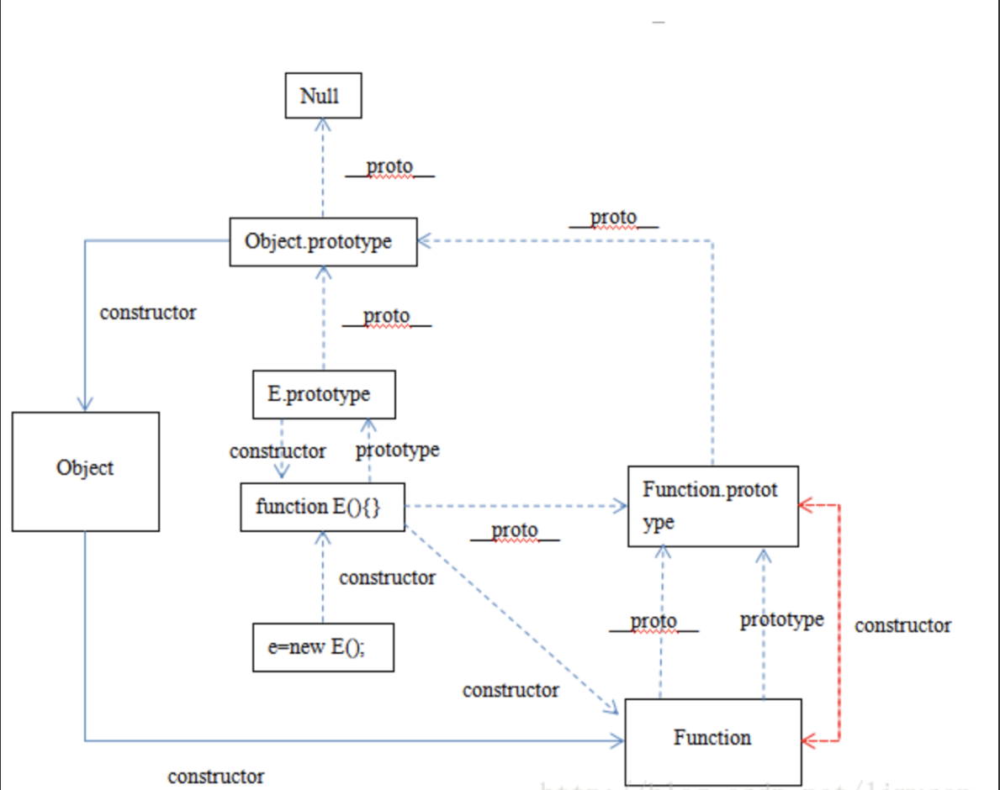

# 原型和原型链

<hr/>

<hr/>

> 对象分等级： Object -> Function -> (String, Array, Date, Number, Boolean, Math)内置对象 -> 其他

<hr/>

* 所有的引用类型(函数、数组、对象)都拥有`_proto_`属性（隐式原型）
* 所有的函数都拥有`prototype`属性（显示原型）（仅限函数）

### 一、原型
**问题： 什么是js原型？**

无论什么时候，只要创建了一个新函数，就会根据一组特定的规则为该函数创建一个`prototype`属性，这个属性指向函数的原型对象。
在默认情况下，所有原型对象都会主动获得一个`constructor`（构造函数的属性），这个属性包含一个指向`prototype`属性所在函数的指针。

### 二、原型链
**问题：什么是原型链**

每个构造函数都有一个原型对象(prototype)，原型对象都包含一个指向构造函数的指针(constructor)，而实例都包含一个指向原型对象的内部指针(proto)。

**  **

### 举个例子

```javascript

```

### 解答时间

```javascript
function Cat (name, age, gender) {
    this.name = name;
    this.age = age;
    this.gender = gender;
    this.say = function() {
        console.log('喵');
    }
}

Cat.prototype.play = function() {
    console.log('ball');
}

Cat.prototype.type = 'animal'

var cat1 = new Cat('jason', 12, '男');
cat1.height = 180;
```


* 1、 为什么不在构造函数内部定义方法，却要使用`Obj.prototype.say = function () {}`定义？
```
因为每次去定义一个实例时，都会重新去创建方法，多占用了内存。这样既不环保，也缺乏效率。
每一个函数都有一个prototype属性，只想另一个对象。这个对象的所有的方法和属性，都会被构造函数的实例继承。
这样也就意味着，我们可以把公有的不变的属性和方法，直接定义在prototype对象上。
这样所有实例的属性和方法，其实都指向同一个内存地址,指向prototype对象，提高了运行效率。
```
<hr/>
* 2、 
    * 构造函数的实例的`constructor`会等于构造函数，`cat1.constructor === Cat`。
    * 构造函数的原型的`constructor`指向哪里？
    ```
    console.log(Cat.prototype.constructor === Cat);  // true
    ```
    * 所以 `cat1.constructor === Car.prototype.constructor`。
<hr/>
* 3、 怎么去判断某一个是来时本地属性(构造函数继承或者定义)，还是来自`prototype`对象的属性？
```
cat1.hasOwnProerty('name');    // true   =>   构造函数继承
cat1.hasOwnProerty('height');  // true   =>   实例定义
cat1.hasOwnProerty('type');    // false  =>   原型定义 
```


